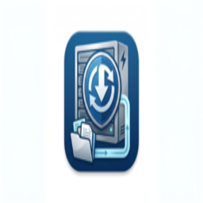
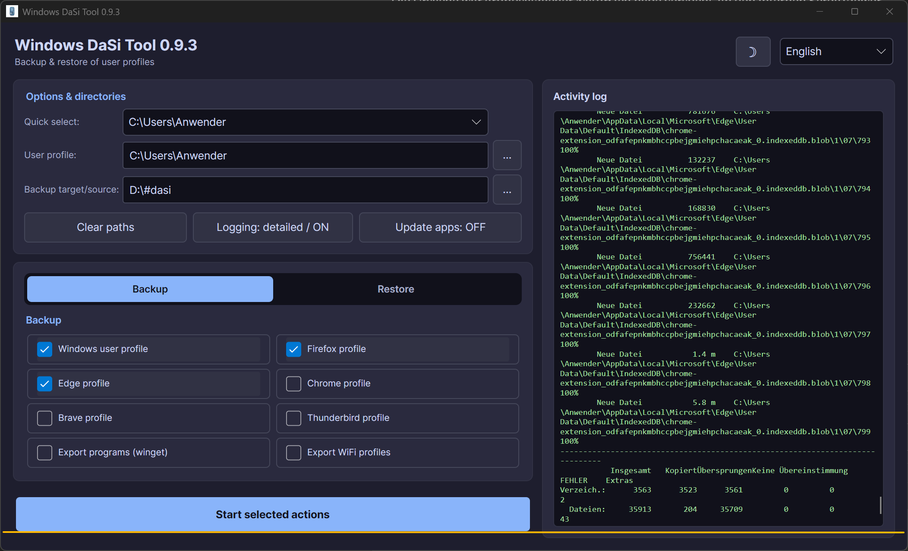
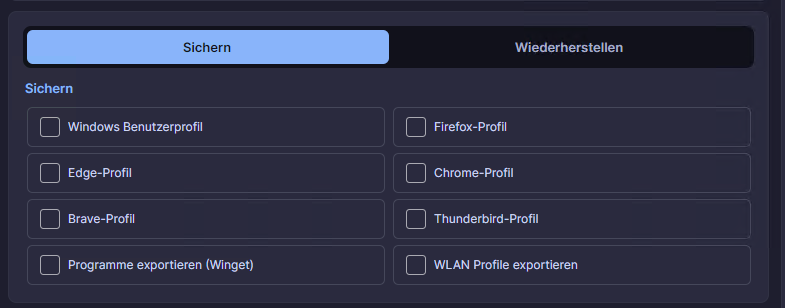
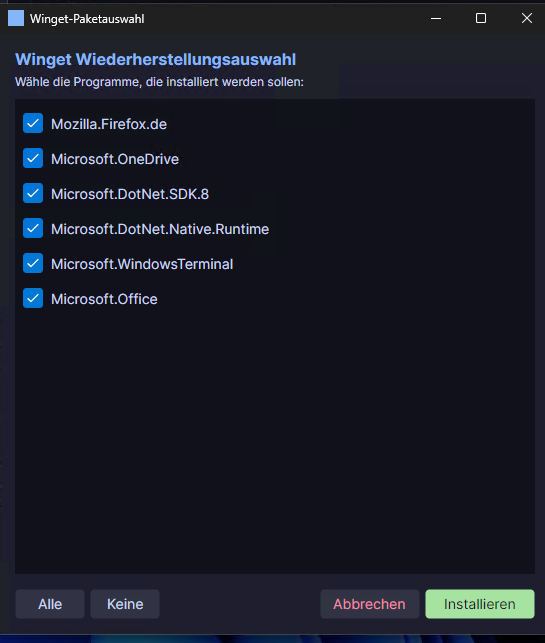

<div align="center">



# Windows DaSi Tool

**Datensicherung und Wiederherstellung von Windows-Benutzerprofilen — portabel, schnell, ohne Installation.**

[](https://github.com/Tinnitus97/Windows.DaSi.Tool/releases)
[](https://github.com/Tinnitus97/Windows.DaSi.Tool)
[](https://dotnet.microsoft.com/download/dotnet/10.0)
[](LICENSE)

</div>

---

Entwickelt fuer IT-Administratoren und Power-User. Das Tool vereint die Robustheit
von **Robocopy** mit einer modernen, zweisprachigen Oberflaeche und sichert in einem
Durchgang Benutzerprofile, Browserdaten, installierte Programme und WLAN-Zugaenge.

<div align="center">

</div>

---

## Was das Tool sichert

| Bereich | Inhalt |
| --- | --- |
| **Windows-Benutzerprofil** | Vollstaendige Sicherung mit intelligentem Ausschluss von Cache-, Temp- und OneDrive-Ordnern |
| **Browser-Profile** | Firefox, Edge, Chrome und Brave — inklusive Lesezeichen, Verlauf und Einstellungen |
| **E-Mail** | Thunderbird-Profil mit Konten und lokalen Ordnern |
| **Programme** | Export der installierten Software als Winget-Paketliste, Wiederherstellung mit Auswahldialog |
| **Netzwerk** | Export und Import gespeicherter WLAN-Profile inklusive Zugangsdaten |
| **Drucker** | Warteschlangen, Treiber, Ports und Einstellungen ueber PrintBRM in einer Datei |
| **Hintergrundbild** | Sichert das Desktop-Hintergrundbild und stellt es am Originalpfad wieder her |

---

## Highlights

### Ein Bereich, zwei Richtungen

Sichern und Wiederherstellen teilen sich eine Ansicht. Der Umschalter oben wechselt
die Richtung, die Beschriftungen passen sich automatisch an — aus *Programme
exportieren* wird *Programme installieren*.

<div align="center">

</div>

### Schnellauswahl der Benutzerprofile

Alle echten Profile unter `C:\Users` stehen im Dropdown bereit. System- und
Dienstprofile werden automatisch herausgefiltert, sodass nur relevante Konten
erscheinen.

### Zweisprachig und mit Hell-/Dunkelmodus

Die gesamte Oberflaeche inklusive Aktivitaetsprotokoll laesst sich zwischen
**Deutsch** und **Englisch** umschalten. Sprache und Farbschema werden beim Start
aus den Windows-Einstellungen uebernommen und lassen sich jederzeit ueber das
Sonne-/Mond-Symbol und das Sprach-Dropdown aendern.

### Nachvollziehbares Protokoll

Jeder Schritt wird in Echtzeit protokolliert — inklusive der vollstaendigen
Robocopy-Ausgabe. Das Protokoll scrollt automatisch mit, haelt aber an, sobald
man zum Nachlesen nach oben scrollt.

### Winget-Integration

Beim Export wird `winget export` verwendet und die Liste um Zusatz- und
Laufzeitpakete bereinigt. Beim Wiederherstellen kann gezielt ausgewaehlt werden,
was installiert werden soll.

<div align="center">

</div>

---

## Selbstaktualisierung

Beim Start holt das Programm **eine** Datei:

```
https://raw.githubusercontent.com/Tinnitus97/Windows.DaSi.Tool/HEAD/update.json
```

Gibt es eine neuere Fassung, erscheint über dem Protokoll ein gelber Streifen
mit zwei Schaltflächen — **Was ist neu?** und **Jetzt aktualisieren**. Gibt es
nichts, bleibt er unsichtbar.

**Heruntergeladen und ersetzt wird nichts ohne Rückfrage.** Vor dem Austausch
wird die **SHA256-Summe** der geladenen Datei mit der Angabe aus `update.json`
verglichen; stimmt sie nicht, wird die Datei verworfen.

Eine laufende EXE kann sich unter Windows nicht selbst überschreiben. Deshalb
schreibt das Programm ein kleines Skript nach `%TEMP%\WindowsDaSiTool-Update`,
das auf sein Ende wartet, die Datei ersetzt und neu startet. Schlägt das fehl
(fehlende Schreibrechte, oder das Programm läuft anderswo aus demselben Ordner),
bleibt ein Fenster mit dem Grund und dem Pfad zur neuen Fassung stehen.

Für ein internes Spiegelverzeichnis lässt sich in `Update-Url.txt` **neben der
EXE** eine abweichende Adresse hinterlegen — eine Zeile, vollständige
`https://…`-Adresse.

> Warum nicht `api.github.com`? Die Schnittstelle erlaubt ohne Anmeldung nur 60
> Abrufe je Stunde und IP-Adresse — in einer Firma sitzen alle Rechner hinter
> derselben Adresse. `raw.githubusercontent.com` kennt diese Grenze nicht.

Wie eine neue Fassung veröffentlicht wird — im Browser, in GitHub Desktop oder
auf der Kommandozeile — steht in **[docs/VEROEFFENTLICHEN.md](docs/VEROEFFENTLICHEN.md)**.

---

## Systemanforderungen

| Anforderung | Details |
| --- | --- |
| **Betriebssystem** | Windows 10 oder Windows 11 (64 Bit) |
| **Berechtigungen** | Administratorrechte — die UAC-Abfrage erfolgt automatisch beim Start |
| **Dateisystem** | Das Backup-Ziel muss auf einem **NTFS**-Laufwerk liegen (Robocopy-Voraussetzung) |
| **.NET** | Nicht erforderlich — die Laufzeit ist in der EXE enthalten |

---

## Nutzung

1. Aktuelle `WindowsDaSiTool.exe` aus dem [Releases-Bereich](https://github.com/Tinnitus97/Windows.DaSi.Tool/releases) herunterladen.
2. EXE starten und die UAC-Abfrage mit **Ja** bestaetigen.
3. Ueber die **Schnellauswahl** das Benutzerprofil waehlen (oder per `...` manuell suchen).
4. Das **Backup-Ziel** festlegen — ein Ordner auf einem NTFS-Laufwerk.
5. Modus **Sichern** oder **Wiederherstellen** waehlen und die gewuenschten Punkte ankreuzen.
6. **Ausgewaehlte Aktionen starten** — der Fortschritt erscheint im Protokoll.

> **Hinweis zu Passwoertern:** Gespeicherte Browser-Passwoerter sind im Profil-Backup
> verschluesselt enthalten und funktionieren nach der Wiederherstellung auf demselben
> Rechner und Benutzerkonto wieder. Fuer einen Wechsel auf einen anderen Rechner nutze
> den Export-Dialog des jeweiligen Browsers (z. B. `edge://settings/passwords`).

---

## Technische Details

| | |
| --- | --- |
| **Sprache** | C# |
| **UI-Framework** | [Avalonia](https://avaloniaui.net/) 12.1 |
| **Zielplattform** | .NET 10 (LTS), `win-x64`, self-contained |
| **Dateioperationen** | Robocopy mit Spiegelung, Ausschlusslisten und Multithreading |
| **Prozess-Handling** | Browser und Thunderbird werden vor dem Backup automatisch geschlossen, um Dateikonflikte zu vermeiden |
| **Fehlerbehandlung** | Unerwartete Fehler landen in `%USERPROFILE%\Desktop\WindowsDaSiTool_Absturz.log` |

### Selbst bauen

Voraussetzung ist das [.NET 10 SDK](https://dotnet.microsoft.com/download/dotnet/10.0).

```powershell
git clone https://github.com/Tinnitus97/Windows.DaSi.Tool.git
cd Windows.DaSi.Tool
.\build.ps1
```

Die fertige EXE liegt anschliessend im Ordner `publish`.

| Parameter | Wirkung |
| --- | --- |
| `.\build.ps1` | Self-contained Build (Standard) — laeuft ohne installiertes .NET |
| `.\build.ps1 -Mode framework` | Deutlich kleinere EXE, setzt .NET 10 Desktop Runtime voraus |
| `.\build.ps1 -Sign` | Signiert die EXE, um SmartScreen-Warnungen zu reduzieren |

---

## Hinweis zu SmartScreen

Die EXE ist nicht mit einem kostenpflichtigen Zertifikat signiert. Windows zeigt
beim ersten Start daher moeglicherweise eine SmartScreen-Warnung. Ueber
**Weitere Informationen -> Trotzdem ausfuehren** laesst sie sich starten. Wer die
Warnung vermeiden moechte, kann das Projekt selbst bauen und mit einem eigenen
Zertifikat signieren.

---

## Changelog

Alle Aenderungen sind in der [CHANGELOG.md](CHANGELOG.md) dokumentiert.

---

## Lizenz

Dieses Projekt steht unter der [MIT-Lizenz](LICENSE).
